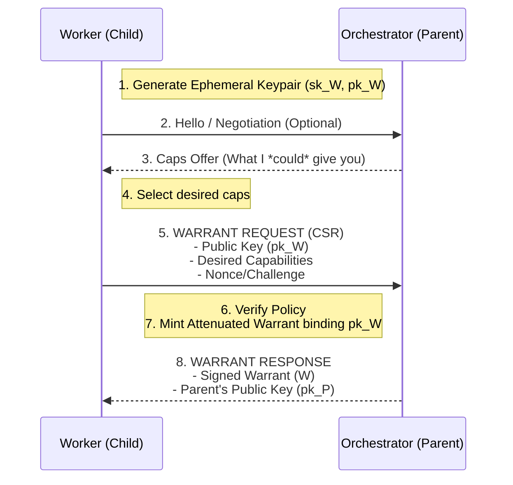

# Agent-to-Agent (A2A) Handshake Protocol
**Status:** Conceptual Exploration  
**Date:** 2026-01-16

This document explores a **transport-agnostic control protocol** for the "Registration Handshake" — the process where a Child Agent introduces itself to a Parent Agent (Orchestrator) to receive a Warrant.

## Goals

1.  **Zero-Touch:** Child generates its own identity; Parent doesn't need pre-shared keys.
2.  **Transport Agnostic (mostly):** Defined as abstract messages (Request/Response), easily mapped to HTTP/gRPC.
3.  **Secure:** Prevents man-in-the-middle (MITM) attacks via binding mechanisms.

## The Flow (CSR Pattern)

Similar to ACME (LetsEncrypt) or K8s CSRs.



## Data Model: The Unified Control Protocol

We define a single polymorphic **`WarrantRequest`** envelope that handles both **Initial Registration** and **Renewal (Rotation)**. This standardizes the "Ask" on the wire, while keeping the "Answer" (Warrant construction) under Parent control.

### 1. Warrant Request Envelope

Sent by Child to Parent. Can be transported via HTTP Body, WebSocket, or gRPC.

```rust
struct WarrantRequest {
    /// 1. The Public Key the child wants the warrant bound to.
    /// This establishes Identity.
    pub subject_key: PublicKey,

    /// 2. (Optional) The ID of the warrant being rotated/renewed.
    /// - If `None`: This is an INITIAL REGISTRATION.
    /// - If `Some(id)`: This is a RENEWAL request.
    pub previous_warrant_id: Option<Uuid>,

    /// 3. Replay protection
    pub nonce: [u8; 12],
    pub timestamp: u64,

    /// 4. Proof of Identity
    /// Signature over (subject_key || previous_warrant_id || nonce || timestamp)
    /// Must be verifiable by `subject_key`.
    pub signature: Signature, 
}
```

### 2. Warrant Response

Sent by Parent to Child.

```rust
struct WarrantResponse {
    /// The new signed warrant.
    /// - For Registration: A fresh start.
    /// - For Renewal: A replacement for `previous_warrant_id`.
    pub warrant: SignedWarrant,
    
    /// The public key needed to verify this warrant.
    pub issuer_key: PublicKey,
}
```

## Protocol Flows

### Flow A: Initial Registration (Handshake)

1.  **Child** generates `ephemeral_key`.
2.  **Child** sends `WarrantRequest { subject_key: ephemeral_key, previous: None ... }`.
3.  **Parent** receives request:
    *   Verifies `signature` matches `subject_key`.
    *   **Policy Check:** Decides *what* (if anything) this key is allowed to do. 
        *   (e.g., checks mTLS identity, bootstrap token, or attestation).
4.  **Parent** mints `Warrant A` and returns it.

### Flow B: Renewal (Rotation)

1.  **Child** works until `Warrant A` is near expiry.
2.  **Child** sends `WarrantRequest { subject_key: ephemeral_key, previous: Some(WarrantA.id) ... }`.
3.  **Parent** receives request:
    *   Verifies `signature`.
    *   **Chain Check:** Verifies `Warrant A` is valid, known, and not revoked.
    *   **Policy Check:** Is this task still allowed to continue?
4.  **Parent** mints `Warrant B` (a replacement) and returns it.
    *   `Warrant B` typically has extended TTL but same (or attenuated) capabilities.

## Security Analysis

*   **Identity vs. Authority:** The Child asserts *Identity* ("I am Key X, and I hold Key X"). The Parent asserts *Authority* ("Key X is now allowed to do Y").
*   **Replay Protection:** The `timestamp` + `nonce` prevents capturing a request and replaying it to force a renewal (though Tenuo's idempotency makes this low risk, it prevents log spam).
*   **Rotation:** By binding the renewal to the `previous_warrant_id`, we create a traceable lineage of warrants for a single task session.

## Method C: Deterministic Pre-Provisioning (HD Keys)

In high-scale environments (e.g., spawning 10,000 workers), even a single RTT handshake might be undesirable. Tenuo supports a **"Zero-Handshake"** model using Hierarchical Deterministic (HD) Keys (BIP-32 / SLIP-0010).


### Rust Implementation Strategy

To support Method C in `tenuo-core`, we will introduce a new `hd-keys` feature flag.

1.  **Dependencies:**
    *   Add `slip10` (or similar Ed25519-compatible HD crate) to `Cargo.toml`.
    *   `ed25519-dalek` is already used; we need a bridge to convert derived keys into `tenuo_core::crypto::SigningKey`.

2.  **New Structs (`src/crypto/hd.rs`):**

    ```rust
    // A Master Key (xpriv equivalent) capable of derivation
    pub struct MasterKey {
        seed: [u8; 64],
    }

    impl MasterKey {
        /// Derive a child SigningKey at a specific index
        /// Uses SLIP-0010 Hardened Derivation
        pub fn derive_child(&self, index: u32) -> crate::crypto::SigningKey {
            // 1. Perform SLIP-10 derivation
            // 2. Convert result to Ed25519 Secret Key
            // 3. Wrap in Tenuo SigningKey
        }
    }
    ```

3.  **Integration Points:**
    *   **Orchestrator:** Uses `MasterKey::derive_child(i)` to generate the Worker's `SigningKey`.
    *   **Parent:** Uses `MasterKey::derive_child(i).public_key()` to get the `PublicKey` for the Warrant.
        *(Note: Since SLIP-0010 is hardened, the Parent technically needs the outcome of the derivation. In the Orchestrator-Dealer model, the Orchestrator sends just the `PublicKey` to the Parent implementation).*

