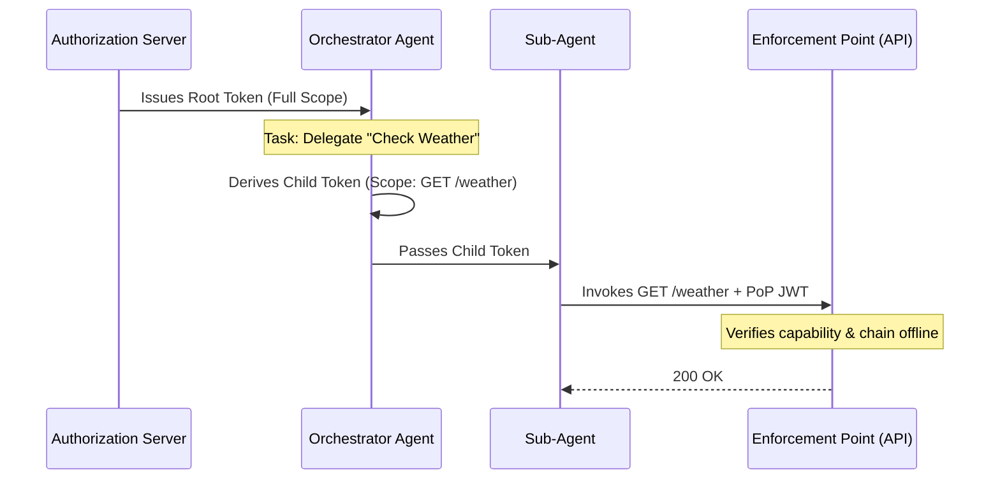

# Attenuating Authorization Tokens (AATs)

> [!NOTE]
> This page is a **non-normative summary** for readers learning the problem space. The **Internet-Draft** is the only authoritative specification; section numbers (§) refer to [draft-niyikiza-oauth-attenuating-agent-tokens-00](https://datatracker.ietf.org/doc/draft-niyikiza-oauth-attenuating-agent-tokens-00/) and may change in later revisions.

[Tenuo](https://tenuo.ai) ships **warrants** today: task-scoped capability tokens with monotonic attenuation, delegation chains, and proof-of-possession at enforcement. The AAT work standardizes a closely related OAuth-shaped design for agent delegation; we track the draft and publish this summary so teams can compare terminology and properties.

---

## The Problem

AI agent frameworks grant agents OAuth tokens scoped to a user or service
account, not to the task the agent is performing. An agent authorized to
book travel holds the same credentials when checking flight availability as
when completing a purchase and charging a corporate card. The token does not
change when the task narrows.

**Concrete scenario:** If an orchestrator agent wants to delegate *"check the weather in London"* to a sub-agent, today it must pass its entire API token, potentially exposing its ability to *"delete user databases"*. With AATs, the orchestrator locally derives a child token that is cryptographically constrained strictly to `GET /weather`, ensuring the sub-agent cannot wander outside the delegated intent.

The same gap appears in delegation chains. When an orchestrator delegates a
narrow task to a sub-agent, there is no standardized holder-driven mechanism
to derive and pass down a narrower token at each hop.

This is the confused deputy problem in agentic delegation chains.
Current mechanisms only partially address it:

- **Token Exchange (RFC 8693)** requires a synchronous round-trip to the
  Authorization Server (AS) at each delegation hop, making the AS a
  participant in each delegation decision. In high-frequency agent networks—where sub-agents may spawn asynchronously, run on edge hardware, or operate in high-concurrency loops—requiring a call-home to a central Authorization Server for every micro-delegation creates a crippling single point of failure and shatters autonomous scalability.
- **Rich Authorization Requests (RFC 9396)** provides expressive capability
  descriptions but does not define how a token holder produces a narrower
  token, or how a chain of such derivations is verified.

Current OAuth specifications do not define all of the following in one
delegation-chain protocol: holder-driven task attenuation, cryptographically
enforced monotonic scope reduction, and offline chain verification at the
enforcement point.

---

## Core Protocol

AATs combine three properties that existing OAuth mechanisms do not provide
together:

**1. Task-scoped capability tokens.** Each AAT encodes which tools an agent
may invoke and with what argument constraints, scoped to the specific task.
Authority is carried in the token itself, not inferred from identity.

**2. Holder-derivable attenuation.** Any token holder can derive a
child token locally without contacting the AS. The derived token's authority
is cryptographically constrained to be a subset of the parent's. This is the
monotonic attenuation invariant.

**3. Self-contained chain verification.** The full chain, ordered from root
to leaf, is presented to the enforcement point at invocation time. The
enforcement point verifies each adjacent pair independently using the root
trust anchor public key. At authorization decision time, this check does not
require AS round-trips or chain-state lookups. By induction across pairwise
checks, the leaf's scope is guaranteed to be a subset of the root's scope
regardless of chain length.

### Delegation Flow



The protocol distinguishes delegation tokens, which authorize deriving child
tokens, from execution tokens, which authorize tool invocation. A separate
key is required when crossing that boundary. Under correct key separation and
boundary enforcement, this prevents a compromised orchestrator from invoking
tools directly with delegation credentials.

### Monotonic Attenuation Invariant (I4)

The central security property:

```text
tools(derived) ⊆ tools(parent)
∀ tool ∈ tools(derived):
  constraints(derived, tool) ⊑ constraints(parent, tool)
```

Every derivation step can only narrow or maintain scope. The specification
defines a typed constraint vocabulary (`exact`, `pattern`, `range`, `one_of`,
`regex`, `cel`, `wildcard`, `all`, `any`, `not`) in **§3.4**, with normative
subsumption rules per type and cross-type pair in **§4.5** (I4). Enforcement
points verify I4 structurally at each chain link without evaluating
application predicates.

This draws on capability-based security theory (Dennis 1966, Miller 2006)
and builds on Macaroons (Birgisson et al., 2014) and Biscuit for the
attenuation model, adding asymmetric proof of possession, a typed constraint
vocabulary with normative subsumption rules, and a delegation-chain structure
designed specifically for agentic systems.

### Six Link Invariants

The chain verification algorithm enforces six invariants at every link:

#### I1 — Delegation authority

The derived token was signed by the holder of the parent token (`derived.iss` equals the JWK Thumbprint of `parent.cnf.jwk`). Each link was signed by the party that held the preceding token.

#### I2 — Depth monotonicity

`del_depth` increments by exactly one and cannot exceed `del_max_depth`. The root issuer sets `del_max_depth` as a topology constraint that intermediate holders can only lower, never raise.

#### I3 — TTL monotonicity

Derived tokens cannot outlive their parent. TTL is a mandatory attenuation dimension and the primary revocation mechanism in the draft (**§4.4**, non-normative deployment guidance in **Appendix B.8**). TTL-bound expiry is not a substitute for RS-side policy, explicit revocation where available, or root re-issuance when a deployment needs immediate withdrawal of authority.

#### I4 — Capability monotonicity

Derived token scope is a subset of the parent's, enforced per **§4.5** (same subsumption rules summarized above).

#### I5 — Cryptographic linkage

`par_hash` binds each token to the SHA-256 digest of the parent's JWS Signing Input, preventing chain splicing.

#### I6 — Proof of possession

The presenter signs a PoP JWT with the private key corresponding to the leaf token's `cnf.jwk` (**§4.7**, normative PoP JWT construction and verification in **§5**, including replay bounds in **§5.3**). Similar to DPoP (RFC 9449), but extended for payload bounds, this binds the invocation not just to a TLS channel, but to the specific tool name, argument map, and leaf token identity.

---

## Mapping to Identified Agent Security Gaps

Several active IETF discussions have identified gaps in agent authorization.
AATs map to those gaps as follows:

**Fine-grained access control.** AATs encode which tools an agent
may invoke and with what argument constraints, scoped to the task. A billing
agent authorized to process refunds under $500 for a specific customer cannot
process a $5,000 refund for a different customer. The enforcement point
rejects the invocation before execution based on token-contained constraints.

**Loss of security context across delegation hops.** The `par_hash` claim
cryptographically binds each derived token to its parent's exact bytes. The
full delegation chain travels with the token and is verifiable at the
enforcement point using only the root trust anchor. Security context is
embedded in the artifact itself, not held in a central registry.

**Tool scope vs. natural-language control.** Malicious or misleading natural-language instructions cannot expand *authorized tool scope*: the enforcement point authorizes from the leaf token and PoP JWT, not from the model's rationale, so invocations outside that scope are rejected. This does not by itself contain misuse *within* allowed tools (e.g. exfiltration via permitted APIs). It aligns with [CaMeL](https://arxiv.org/abs/2503.18813) (Debenedetti et al., 2025), which stresses execution-boundary control as one containment layer.

**Cross-domain security context.** Because AAT chains are self-contained and
verifiable at decision time, a chain issued in domain A can be verified in
domain B without calling the issuing AS for each authorization check.

**Auditability and accountability.** Every tool invocation produces a signed
PoP JWT binding the invocation to the specific leaf token, tool name, and
argument map. The full chain plus the PoP JWT forms a tamper-evident,
cryptographically attributable audit record.

---

## Relationship to WIMSE

WIMSE establishes workload identity and authentication across service
boundaries. AATs define what happens to authorization scope at each
delegation hop once identity is established. The two are complementary:
WIMSE answers who the workload is; AATs answer what it is authorized to do,
for this task, at this depth in the chain.

The draft references both WIMSE-ARCH and WIMSE-S2S and includes a
non-normative appendix on this relationship.

---

## Relationship to Other Active Drafts

Several drafts address adjacent problems. [HDP](https://datatracker.ietf.org/doc/draft-helixar-hdp-agentic-delegation/)
(draft-helixar-hdp-agentic-delegation) and [IPP](https://datatracker.ietf.org/doc/draft-haberkamp-ipp/)
(draft-haberkamp-ipp) focus on delegation provenance and audit trails.
SPICE actor-chain drafts focus on identity chaining. AATs address a different
layer: runtime capability enforcement at the tool boundary, with
cryptographically enforced attenuation across delegation hops. These
approaches are complementary.

The draft extends existing OAuth primitives, specifically RAR (RFC 9396) for
capability claims and WIMSE for workload identity, rather than introducing a
new protocol stack.

---

## Open questions in the draft / WG

Three areas where working-group input would be most valuable:

**1. Scope of the problem statement.** Are there deployment scenarios,
particularly in cross-domain or mobile network contexts, where the AAT
delegation model creates friction that should inform the requirements
document?

**2. Relationship to identity chaining.** AATs complement WIMSE by defining
what a workload is authorized to do once identity is established. Is this the
right division of responsibility, or should capability delegation be part of
the identity layer?

**3. Standards reuse.** The draft extends RAR (RFC 9396) for tool-level
capability claims. Is this the right extension point, or is there a cleaner
path that avoids profiling RAR for a use case it was not originally designed
for?

---

Full text (HTML): [draft-niyikiza-oauth-attenuating-agent-tokens-00](https://www.ietf.org/archive/id/draft-niyikiza-oauth-attenuating-agent-tokens-00.html)
