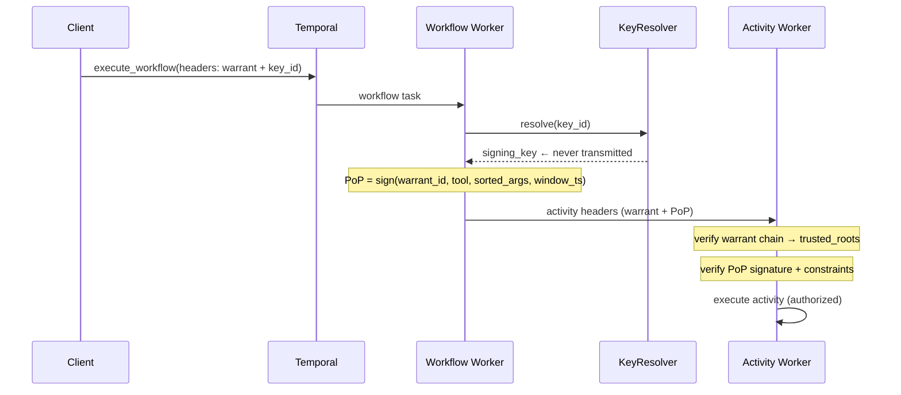

# Tenuo Temporal Integration

> **Available in `tenuo[temporal]`**

## Overview

Tenuo integrates with [Temporal](https://temporal.io) so each activity run is checked against a cryptographically signed warrant before your activity code executes. **Activity definitions stay unchanged:** no Tenuo imports inside `@activity.defn` functions. **Workflow code** must start the run with Tenuo headers (see [Client](#api-ergonomics) below) and either call normal `workflow.execute_activity()` (with `activity_fns` configured when warrants use named argument constraints) or subclass [`AuthorizedWorkflow`](#quick-start) and use `execute_authorized_activity()` for early failure if headers are missing.

The integration runs entirely in your workers (Rust `tenuo_core` in-process). Vault, AWS Secrets Manager, GCP Secret Manager, or env vars supply holder keys. **Tenuo Cloud** is optional: managed issuance, keys, audit, and root rotation for teams that want that, not a requirement to enforce warrants.

**Key Features:**
- **Activity-level authorization**: Each activity execution is authorized against warrant constraints
- **Proof-of-Possession (PoP)**: Ed25519 signature verification for every warranted activity (requires `trusted_roots` on the worker config)
- **Warrant propagation**: Warrants flow through workflow headers automatically
- **Child workflow delegation**: Attenuate warrants when spawning child workflows via `tenuo_execute_child_workflow()`
- **Delegation chain verification**: Full chain-of-trust validation back to trusted roots
- **Signal & update guards**: Restrict which signals and updates a workflow accepts
- **Nexus header propagation**: Warrant context flows through Nexus operations
- **PoP replay protection**: Default in-process dedup plus PoP time-window verification (clock skew); optional **`PopDedupStore`** for fleet-wide dedup ([Security considerations](#security-considerations))
- **Continue-as-new support**: Warrant headers survive workflow continuation (attenuation during continue-as-new is not yet supported)
- **Fail-closed**: Missing or invalid warrants block execution by default
- **Secure key management**: Private keys NEVER transmitted in headers - resolved from Vault/KMS/Secret Manager
- **Enterprise key resolvers**: `VaultKeyResolver`, `AWSSecretsManagerKeyResolver`, `GCPSecretManagerKeyResolver`, `CompositeKeyResolver`

Temporal ensures your workflows survive failures. Tenuo ensures every activity your workflow dispatches is authorized against the warrant the issuer approved. Together they give you durable execution with cryptographic least privilege.

**Security posture in brief:** Activity execution is fail-closed by default: missing or invalid warrants are denied without changes to activity definitions. Each dispatch includes a Proof-of-Possession signature binding tool name and arguments to the holder key. Enforcement is in-process (no Tenuo network hop at verify time); private keys stay in your infrastructure. See [Security considerations](#security-considerations) for threat model, PoP windows, revocation, retries, and dedup.

---

## Installation

```bash
uv pip install "tenuo[temporal]"
```

Requires a Temporal cluster (local `temporal server start-dev` or production).

---

## Temporal plugin (`TenuoTemporalPlugin`)

For [Temporal’s plugin model](https://docs.temporal.io/) (AI Partner Ecosystem–style registration), use **`TenuoTemporalPlugin`** from `tenuo.temporal_plugin`: a [`SimplePlugin`](https://python.temporal.io/temporalio.plugin.html) that wires **client interceptors**, **worker interceptors** (`TenuoPlugin`), and a **sandboxed workflow runner** with `tenuo` / `tenuo_core` passthrough (required for PyO3). (The Temporal plugin name string is `"tenuo.TenuoTemporalPlugin"`, but the Python import is `from tenuo.temporal_plugin import TenuoTemporalPlugin`.)

```python
from temporalio.client import Client
from temporalio.worker import Worker

from tenuo import SigningKey
from tenuo.temporal import TenuoPluginConfig, EnvKeyResolver, execute_workflow_authorized
from tenuo.temporal_plugin import TenuoTemporalPlugin

control = SigningKey.generate()
plugin = TenuoTemporalPlugin(
    TenuoPluginConfig(
        key_resolver=EnvKeyResolver(),
        trusted_roots=[control.public_key],
    )
)

client = await Client.connect("localhost:7233", plugins=[plugin])
worker = Worker(client, task_queue="my-queue", workflows=[...], activities=[...])

# When starting workflows, use plugin.client_interceptor to inject warrant headers:
result = await execute_workflow_authorized(
    client=client,
    client_interceptor=plugin.client_interceptor,
    workflow_run_fn=MyWorkflow.run,
    workflow_id="my-workflow-001",
    warrant=warrant,
    key_id="agent-key-1",
    args=[...],
    task_queue="my-queue",
)
```

Pass the plugin on **`Client.connect(..., plugins=[plugin])`** only: workers created from that client **merge** client plugins, so you should **not** duplicate the same plugin on `Worker(..., plugins=[...])` unless the client was created without plugins.

### `TenuoPlugin` (manual path)

```python
from temporalio.client import Client
from temporalio.worker import Worker
from temporalio.worker.workflow_sandbox import SandboxedWorkflowRunner, SandboxRestrictions
from tenuo import SigningKey
from tenuo.temporal import TenuoPlugin, TenuoPluginConfig, TenuoClientInterceptor, EnvKeyResolver

control = SigningKey.generate()

client_interceptor = TenuoClientInterceptor()
client = await Client.connect("localhost:7233", interceptors=[client_interceptor])

worker_interceptor = TenuoPlugin(TenuoPluginConfig(
    key_resolver=EnvKeyResolver(),
    trusted_roots=[control.public_key],
))
sandbox_runner = SandboxedWorkflowRunner(
    restrictions=SandboxRestrictions.default.with_passthrough_modules("tenuo", "tenuo_core")
)
worker = Worker(client, task_queue="q", workflows=[...], activities=[...],
                interceptors=[worker_interceptor], workflow_runner=sandbox_runner)
```

Manual setup is used in `demo.py`, `delegation.py`, `multi_warrant.py`, and all PoC examples. `ensure_tenuo_workflow_runner` from `tenuo.temporal_plugin` provides the sandbox runner without the full plugin.

---

## Runnable examples

These scripts under [`tenuo-python/examples/temporal/`](https://github.com/tenuo-ai/tenuo/tree/main/tenuo-python/examples/temporal) are the fastest path from “I get the model” to a working worker + client. Run `temporal server start-dev` in one terminal, then `cd tenuo-python/examples/temporal` and run the Python file in another. See the [examples README](https://github.com/tenuo-ai/tenuo/blob/main/tenuo-python/examples/temporal/README.md) for prerequisites such as `boto3` or `tenuo[temporal,mcp]`.

| Example | What it shows |
|---------|----------------|
| [`demo.py`](https://github.com/tenuo-ai/tenuo/tree/main/tenuo-python/examples/temporal/demo.py) | **Start here.** Transparent `workflow.execute_activity()` and `AuthorizedWorkflow` / `execute_authorized_activity()` in one place |
| [`cloud_iam_layering.py`](https://github.com/tenuo-ai/tenuo/tree/main/tenuo-python/examples/temporal/cloud_iam_layering.py) | **IAM + MCP layering:** Temporal + MCP Tenuo boundaries, then S3 via [`cloud_iam_mcp_server.py`](https://github.com/tenuo-ai/tenuo/blob/main/tenuo-python/examples/temporal/cloud_iam_mcp_server.py) (`s3_get_object`); per-tenant prefixes; dry-run without AWS |
| [`multi_warrant.py`](https://github.com/tenuo-ai/tenuo/tree/main/tenuo-python/examples/temporal/multi_warrant.py) | **Multi-tenant isolation:** identical workflow code, different warrants per tenant |
| [`delegation.py`](https://github.com/tenuo-ai/tenuo/tree/main/tenuo-python/examples/temporal/delegation.py) | **Pipeline stages:** least-privilege warrants per stage |
| [`temporal_mcp_layering.py`](https://github.com/tenuo-ai/tenuo/tree/main/tenuo-python/examples/temporal/temporal_mcp_layering.py) | **Temporal + MCP:** activity uses `SecureMCPClient` (stdio); `MCPVerifier` on [`temporal_mcp_server.py`](https://github.com/tenuo-ai/tenuo/blob/main/tenuo-python/examples/temporal/temporal_mcp_server.py). Requires Python 3.10+ and `uv pip install "tenuo[temporal,mcp]"` |

---

## Tenuo concepts for Temporal developers

If you're coming from Temporal's RBAC or namespace-based access control, here's the mental model shift:

| Temporal concept | Tenuo equivalent |
|-----------------|------------------|
| Namespace / RBAC ("this service can run activities in namespace X") | **Trusted roots**: issuer public keys whose warrants workers accept (who may grant). |
| Activity type permission | **Warrant capability**: named tool in the signed token; name matches activity type (or `@tool()` mapping). |
| Activity input args | **Constraints**: optional rules in the warrant (e.g. `path=Subpath("/data/")`). Args outside them are denied before the activity runs. |
| "I am in namespace X, so I can run activity Y" | **Warrant holder**: the key pair allowed to hold this warrant; only it can sign PoP for dispatches. |

**Two keys, two roles:**

```
Issuer (control_key)                Holder (agent_key)
────────────────────                ─────────────────
Owned by: authorization team        Owned by: worker / CI / agent process
Lives in: Vault, KMS, CI secret,    Lives in: worker's KeyResolver (Vault, etc.)
          or Tenuo Cloud
Used to: mint warrants               Used to: sign PoP on each activity dispatch
If compromised: rotate trusted root  If compromised: rotate key_id + re-issue warrant
```

The issuer key never touches the worker. The holder key never leaves the worker. Headers carry only the holder `key_id` and warrant material, not private keys.

---

## Onboarding checklist

Follow this order the first time you integrate Tenuo with Temporal. The **Quick Start** and **Configuration** sections below go deeper; the [`tenuo.temporal`](https://github.com/tenuo-ai/tenuo/blob/main/tenuo-python/tenuo/temporal.py) module docstring has a **Troubleshooting** section for common failures.

1. **Install**: `uv pip install "tenuo[temporal]"` (see [Installation](#installation)). This installs `tenuo_core`, a compiled Rust extension. Prebuilt wheels are available for common platforms; if yours isn't covered, build from source with `maturin develop` in `tenuo-python`.

2. **Temporal server**: Run a dev server (e.g. `temporal server start-dev`). See [examples/temporal README](../tenuo-python/examples/temporal/README.md).

3. **Keys for PoP**: Proof-of-Possession (PoP) is how each activity dispatch proves it was authorised by the workflow that holds the warrant. It needs two Ed25519 key-pairs:
   - **Issuer key (`control_key`)**: signs warrants; stays with policy owners (Vault, KMS, CI, or Tenuo Cloud). Never on the worker. Tenuo Cloud can hold and rotate the issuer key if you use it.
   - **Holder key (`agent_key`)**: signs a short-lived challenge on each `execute_activity()` call, binding the exact tool and arguments. Lives on the worker via a `KeyResolver`.

   Create both with `SigningKey.generate()`. Expose the holder key to the worker via `KeyResolver` (development: `EnvKeyResolver` + `TENUO_KEY_<key_id>`: see [Development: Environment Variables](#development-environment-variables)).

4. **Mint a warrant**: Use `Warrant.mint_builder()` (or `Warrant.issue`) so capabilities match your activity names and argument constraints (e.g. `path=Subpath(...)`). In production, warrants are typically minted by Tenuo Cloud on behalf of your workflows, separating authorization policy from application code and giving your security team control over what gets issued without touching workflow definitions.

   > **⚠️ Zero-trust mode (closed-world constraint):** When ANY field in a capability is constrained, ALL other activity arguments must also be declared — even if you don't want to restrict them. Use `Wildcard()` (preferred for root warrants) or `Pattern("*")` to explicitly allow any value. If you omit an argument, it will be rejected with `unknown field not allowed (zero-trust mode)`. Example: if your `write_file` activity takes `(path, content)` and you constrain `path=Subpath(...)`, you **must** also declare `content=Wildcard()`.

   > **⚠️ Python default arguments are not in Temporal's wire format:** If your warrant constrains a parameter that has a Python default value (e.g. `model="claude-3-haiku"`), you **must** pass that parameter explicitly when calling `execute_activity()`. Temporal does not include default arguments in the serialized activity input — they will appear as missing from the PoP args dictionary, causing a `missing required argument` error. Always pass constrained parameters explicitly, even if they have defaults.

5. **Worker config**: `Worker(..., interceptors=[TenuoPlugin(TenuoPluginConfig(...))])` with:
   - `key_resolver`: resolves `key_id` from headers to the holder signing key. If you use `EnvKeyResolver`, call `resolver.preload_keys(["<key_id>", ...])` for every holder `key_id` **before** you construct the worker. PoP signing runs inside the workflow sandbox and calls `resolve_sync()`; the sandbox blocks `os.environ` as non-deterministic, so keys must be cached first.
   - `trusted_roots`: **required** (e.g. `[control_key.public_key]`, or set `tenuo.configure(trusted_roots=[...])` before constructing the config)
   - `activity_fns`: **required when** the warrant uses **named field constraints** and you call `workflow.execute_activity()` without a reliable activity function reference; use the **same** callables as `Worker(activities=[...])`
   - `strict_mode=True`: recommended when using named constraints with transparent `execute_activity` (fail-fast instead of only logging)

6. **Workflow sandbox passthrough (required)**: Use `SandboxedWorkflowRunner` with `SandboxRestrictions.default.with_passthrough_modules("tenuo", "tenuo_core")`. Omitting this causes `ImportError: PyO3 modules may only be initialized once...`.

7. **Client**: Attach `TenuoClientInterceptor` to `Client.connect(..., interceptors=[...])` (or use `TenuoTemporalPlugin` which provides it via `plugin.client_interceptor`). Bind headers before start with **`execute_workflow_authorized(...)`** (best under concurrency) or `set_headers_for_workflow(workflow_id, tenuo_headers(warrant, key_id))` then `execute_workflow`. Without this, warrants are not injected into workflow headers.
8. **Child workflows**: For any child that must run under Tenuo, use [`tenuo_execute_child_workflow()`](#child-workflow-delegation) only. The SDK's `workflow.execute_child_workflow()` does not propagate warrant headers; children started that way have no authorization context.

9. **Run the samples**: See the [Runnable examples](#runnable-examples) table (`demo.py` first, then `cloud_iam_layering.py`, `multi_warrant.py`, `delegation.py`, and optionally `temporal_mcp_layering.py`).

10. **Verify with tests**: Without a Temporal server: `cd tenuo-python && pytest tests/e2e/test_temporal_e2e.py`. With the in-process Temporal test server (CI-style): `pytest tests/e2e/test_temporal_live.py tests/e2e/test_temporal_replay.py -m temporal_live` (see the `temporal-integration` job in `.github/workflows/ci.yml`).

---

## Quick Start

### Basic Workflow Protection

> **Development quick start:** `EnvKeyResolver` reads holder keys from environment variables (no Vault). For production, use `VaultKeyResolver`, `AWSSecretsManagerKeyResolver`, or `GCPSecretManagerKeyResolver` ([Key Management](#key-management-required)).

This snippet uses **`AuthorizedWorkflow`** and **`execute_authorized_activity()`** so a missing warrant fails at workflow start. The same warrant and interceptor setup also supports plain **`workflow.execute_activity()`** with no workflow base class; then set **`activity_fns`** when your warrant uses named field constraints ([registry section](#activity-registry-activity_fns-and-pop-argument-names)). See [`demo.py`](https://github.com/tenuo-ai/tenuo/tree/main/tenuo-python/examples/temporal/demo.py) for both styles.

```python
from datetime import timedelta
from pathlib import Path
from temporalio import activity, workflow
from temporalio.client import Client
from temporalio.common import RetryPolicy
from temporalio.worker import Worker

from tenuo import SigningKey, Warrant
from tenuo_core import Subpath
from tenuo.temporal import (
    AuthorizedWorkflow,
    TenuoPlugin,
    TenuoPluginConfig,
    TenuoClientInterceptor,
    EnvKeyResolver,
    execute_workflow_authorized,
    tenuo_headers,
)

# Define protected activities (no Tenuo-specific code needed)
@activity.defn
async def read_file(path: str) -> str:
    return Path(path).read_text()

@activity.defn
async def write_file(path: str, content: str) -> str:
    Path(path).write_text(content)
    return f"Wrote {len(content)} bytes"

# Define workflow: AuthorizedWorkflow fails fast if warrant headers are missing
@workflow.defn
class DataProcessingWorkflow(AuthorizedWorkflow):
    @workflow.run
    async def run(self, input_path: str, output_path: str) -> str:
        # Automatic PoP signature generation via self.execute_authorized_activity
        data = await self.execute_authorized_activity(
            read_file,
            args=[input_path],
            start_to_close_timeout=timedelta(seconds=30),
            # Always include non_retryable_error_types=["TemporalConstraintViolation", "PopVerificationError", "WarrantExpired", "TenuoArgNormalizationError", "TenuoPreValidationError"] in your RetryPolicy to prevent Temporal from retrying authorization failures.
            retry_policy=RetryPolicy(maximum_attempts=1),
        )

        processed = data.upper()
        
        await self.execute_authorized_activity(
            write_file,
            args=[output_path, processed],
            start_to_close_timeout=timedelta(seconds=30),
            retry_policy=RetryPolicy(maximum_attempts=1),
        )

        return f"Processed {len(data)} bytes"

# Setup
async def main():
    # Generate issuer (control) key and holder (agent) key.
    # In production: control_key belongs to your authorization team (stored in Vault/KMS,
    # used only to mint warrants). agent_key belongs to this worker process (stored in
    # the worker's KeyResolver, used to sign PoP on each activity dispatch).
    control_key = SigningKey.generate()
    agent_key = SigningKey.generate()

    # EnvKeyResolver reads TENUO_KEY_<key_id> from environment.
    # Register the agent key before starting the worker:
    import os, base64
    os.environ["TENUO_KEY_agent-key-1"] = base64.b64encode(bytes(agent_key.secret_key_bytes())).decode()

    client_interceptor = TenuoClientInterceptor()
    client = await Client.connect("localhost:7233", interceptors=[client_interceptor])

    # Issue warrant using the builder API
    warrant = (
        Warrant.mint_builder()
        .holder(agent_key.public_key)
        .capability("read_file", path=Subpath("/data/input"))
        .capability("write_file", path=Subpath("/data/output"))
        .ttl(3600)
        .mint(control_key)
    )
    # In production, warrants are typically minted by Tenuo Cloud on behalf of your
    # workflows: scoped to the specific task, delegated to the correct holder key,
    # and managed without embedding issuance logic in application code. This separates
    # authorization policy from application code and gives your security team
    # visibility and control over what gets issued.

    # Configure worker interceptor with full PoP verification
    key_resolver = EnvKeyResolver()
    key_resolver.preload_keys(["agent-key-1"])  # cache holder key before Worker(...); sandbox PoP cannot use os.environ

    interceptor = TenuoPlugin(
        TenuoPluginConfig(
            key_resolver=key_resolver,
            on_denial="raise",
            trusted_roots=[control_key.public_key],  # required: Authorizer + PoP
            strict_mode=True,  # optional: fail-fast on ambiguous PoP with named constraints
        )
    )

    # Start worker with interceptor and sandbox passthrough
    from temporalio.worker.workflow_sandbox import (
        SandboxedWorkflowRunner, SandboxRestrictions,
    )

    async with Worker(
        client,
        task_queue="data-processing",
        workflows=[DataProcessingWorkflow],
        activities=[read_file, write_file],
        interceptors=[interceptor],
        workflow_runner=SandboxedWorkflowRunner(
            restrictions=SandboxRestrictions.default.with_passthrough_modules(
                "tenuo", "tenuo_core",  # Required for PoP signing
            )
        ),
    ):
        result = await execute_workflow_authorized(
            client=client,
            client_interceptor=client_interceptor,
            workflow_run_fn=DataProcessingWorkflow.run,
            workflow_id="process-001",
            warrant=warrant,
            key_id="agent-key-1",
            args=["/data/input/report.txt", "/data/output/report.txt"],
            task_queue="data-processing",
        )
```

> **Security:** Private keys are **NEVER** transmitted in headers. Only the `key_id` is sent. Workers use `KeyResolver` to fetch the actual signing key from secure storage (Vault, AWS Secrets Manager, GCP Secret Manager, etc.).

**What happens:**



The signing key is resolved on the **worker** and never leaves it. PoP is computed at **schedule time** (binding exact tool and args), then verified on the **activity worker** before execution.

This works in both single-process demos and distributed deployments where client and worker run in separate processes.

> **Required passthrough modules:** `tenuo` and `tenuo_core` must be configured as passthrough modules in Temporal's workflow sandbox. Without this, the worker starts and connects normally but **every workflow execution fails on its first task**. No activities are ever scheduled. The worker continues polling and appears healthy from the outside; the failure only appears as workflow task errors in Temporal Web.
>
> Error you will see in Temporal Web:
>
> ```
> ImportError: PyO3 modules may only be initialized once per interpreter process
> ```
>
> **Why this is necessary:** In Temporal’s Python SDK today, OpenTelemetry’s `TracingInterceptor` is **pure Python** and does **not** need workflow sandbox passthrough. Tenuo is different: it computes the Proof-of-Possession signature *inside the workflow sandbox* at `execute_activity()` dispatch time so the exact tool name and arguments are committed at dispatch. Moving signing outside the sandbox would break that guarantee. `tenuo_core` is a PyO3 Rust extension that cannot be re-imported in a sub-interpreter, so both `tenuo` and `tenuo_core` must be declared passthrough. (If OTel’s interceptor ever pulled native code into the sandbox, the same passthrough consideration would apply—today it does not.) See [Sandbox passthrough explained](#sandbox-passthrough-explained) for the full failure sequence and diagnostic steps.

---

## Path to production

Checklist for moving past local demos (each item stands alone; links go deeper):

1. **Issuer vs holder keys** — Issuer (`control_key`) only mints warrants; the holder key is resolved on the worker via a production [`KeyResolver`](#key-management-required) (Vault, AWS Secrets Manager, or GCP Secret Manager), not [`EnvKeyResolver`](#development-environment-variables).
2. **Preload if you still use env keys in lower envs** — Call [`preload_keys`](#development-environment-variables) with every holder `key_id` **before** `Worker(...)`, because PoP signing runs in the workflow sandbox where `os.environ` is unavailable for non-determinism reasons.
3. **Sandbox passthrough** — Every workflow worker must use `SandboxRestrictions.default.with_passthrough_modules("tenuo", "tenuo_core")` so PyO3 can load once; without it, workflow tasks fail with `ImportError: PyO3 modules may only be initialized once...` ([details](#sandbox-passthrough-explained)).
4. **Named argument constraints** — If the warrant constrains fields like `path=` or `bucket=`, set [`activity_fns`](#activity-registry-activity_fns-and-pop-argument-names) to the **same** callables as `Worker(activities=[...])`, or use `tenuo_execute_activity()`, so PoP can name arguments correctly.
5. **Starting workflows under concurrency** — Prefer [`execute_workflow_authorized(...)`](#recommended-default-execute_workflow_authorized) so Tenuo headers are bound to `workflow_id` and are not mixed across parallel starts.
6. **Authorized child workflows** — Use only [`tenuo_execute_child_workflow()`](#child-workflow-delegation); the stock `workflow.execute_child_workflow()` does not propagate warrant headers.
7. **Replicas and PoP replay** — If more than one worker replica can observe the same first activity attempt, use a shared [`PopDedupStore`](#pop-replay-protection); if Temporal retries span longer than your PoP time window, tune [`retry_pop_max_windows`](#temporal-activity-retries-and-pop-time-drift).
8. **Issuer rotation without full redeploy** — Use a [`trusted_roots_provider`](#threat-model-trusted-root-rotation) with a short refresh interval so new issuer keys propagate quickly.

Then walk the [Onboarding checklist](#onboarding-checklist) once for your repo.

---

## API Ergonomics

Use one of these patterns based on your needs:

### Recommended (default): `execute_workflow_authorized(...)`

The safest way to start authorized workflows. Binds headers to a specific workflow ID and executes immediately.

```python
result = await execute_workflow_authorized(
    client=client,
    client_interceptor=client_interceptor,
    workflow_run_fn=DataProcessingWorkflow.run,
    workflow_id="process-001",
    warrant=warrant,
    key_id="agent-key-1",
    args=["/data/input/report.txt", "/data/output/report.txt"],
    task_queue="data-processing",
)
```

### Advanced: `set_headers_for_workflow(...)` + `client.execute_workflow(...)`

Use this when you need manual control over start timing or custom wrappers.

```python
client_interceptor.set_headers_for_workflow(
    "process-001",
    tenuo_headers(warrant, "agent-key-1"),
)
result = await client.execute_workflow(
    DataProcessingWorkflow.run,
    id="process-001",
    args=["/data/input/report.txt", "/data/output/report.txt"],
    task_queue="data-processing",
)
```

### Deprecated: `set_headers(...)`

`set_headers(...)` remains for backward compatibility but is deprecated for concurrent usage. Prefer workflow-ID-bound APIs.

---

## Cross-Process Contract

For distributed deployments (separate client and worker processes), the integration contract is:

| Component | Responsibility | Required |
|-----------|----------------|----------|
| Client | Start workflows with Tenuo headers (`execute_workflow_authorized` or `set_headers_for_workflow`) | Yes |
| Workflow worker | Register `TenuoPlugin` and passthrough modules (`tenuo`, `tenuo_core`) | Yes |
| Activity worker | Receive propagated headers and enforce PoP/constraints | Yes |
| Key management | Resolve `key_id` to signing key using `KeyResolver` | Yes |
| Trusted roots | Provide `trusted_roots` (or global `configure(trusted_roots=...)`); optional `strict_mode=True` for PoP signing strictness | Yes |
| `activity_fns` | Same callables as `Worker(activities=...)` when warrants use **named** field constraints and you use transparent `execute_activity` | When applicable (see below) |
| Child workflows | Start authorized children only with `tenuo_execute_child_workflow()`, not `workflow.execute_child_workflow()` | When you use child workflows |

If any required part is missing, execution fails closed.

## Configuration

### Key Management (REQUIRED)

**Security Requirement:** Tenuo NEVER transmits private keys in headers. Workers must be configured with a `KeyResolver` to fetch signing keys from secure storage.

#### Production: Vault

```python
from tenuo.temporal import VaultKeyResolver, TenuoPluginConfig

resolver = VaultKeyResolver(
    url="https://vault.company.com:8200",
    path_template="production/tenuo/{key_id}",  # e.g., "production/tenuo/agent-2024"
    token=None,  # Uses VAULT_TOKEN env var
    mount="secret",  # KV secrets engine mount
    cache_ttl=300,  # Cache keys for 5 minutes
)

config = TenuoPluginConfig(
    key_resolver=resolver,  # REQUIRED
    trusted_roots=[root_key.public_key],
    strict_mode=True,  # optional: fail-fast on ambiguous PoP with named constraints
)
```

Store keys in Vault:
```bash
# Store signing key in Vault (field name must match what VaultKeyResolver reads)
vault kv put secret/production/tenuo/agent-2024 \
  key=@signing_key.b64  # base64-encode the 32-byte key file first
```

#### Production: AWS Secrets Manager

```python
from tenuo.temporal import AWSSecretsManagerKeyResolver

resolver = AWSSecretsManagerKeyResolver(
    secret_prefix="tenuo/keys/",  # e.g., "tenuo/keys/agent-2024"
    region_name="us-west-2",
    cache_ttl=300,
)

config = TenuoPluginConfig(
    key_resolver=resolver,
    trusted_roots=[root_key.public_key],
    strict_mode=True,  # optional: fail-fast on ambiguous PoP with named constraints
)
```

Store keys in AWS:
```bash
# Store signing key in AWS Secrets Manager
aws secretsmanager create-secret \
  --name tenuo/keys/agent-2024 \
  --secret-binary fileb://signing_key.bin \
  --region us-west-2
```

#### Production: GCP Secret Manager

```python
from tenuo.temporal import GCPSecretManagerKeyResolver

resolver = GCPSecretManagerKeyResolver(
    project_id="my-project",
    secret_prefix="tenuo-keys-",  # e.g., "tenuo-keys-agent-2024"
    cache_ttl=300,
)

config = TenuoPluginConfig(
    key_resolver=resolver,
    trusted_roots=[root_key.public_key],
    strict_mode=True,  # optional: fail-fast on ambiguous PoP with named constraints
)
```

Store keys in GCP:
```bash
# Store signing key in GCP Secret Manager
gcloud secrets create tenuo-keys-agent-2024 \
  --data-file=signing_key.bin \
  --project=my-project
```

#### Development: Environment Variables

```python
from tenuo.temporal import EnvKeyResolver

# DEVELOPMENT ONLY - DO NOT USE IN PRODUCTION
# A one-time WARNING is emitted at first key resolution unless TENUO_ENV looks like a dev
# environment (see below).
resolver = EnvKeyResolver(
    prefix="TENUO_KEY_",
    warn_in_production=True,  # Default; set False to suppress explicitly
)

config = TenuoPluginConfig(
    key_resolver=resolver,
    trusted_roots=[issuer_public_key],  # required (or call tenuo.configure(trusted_roots=[...]) first)
    # strict_mode: optional: set True if you use named warrant constraints with transparent execute_activity
)
```

Set environment variable:
```bash
# Export base64-encoded signing key
export TENUO_KEY_agent1=$(cat signing_key.bin | base64)
# Suppress the production warning in local dev (any of: development, dev, test, testing, local):
export TENUO_ENV=development
```

**What the warning looks like:** On first `resolve()` when `warn_in_production=True` (default) and `TENUO_ENV` is not one of the dev values above, the worker logs (Python `WARNING`, logger name from `tenuo.temporal`):

```text
EnvKeyResolver is designed for development and testing only. In production, use VaultKeyResolver, AWSSecretsManagerKeyResolver, or GCPSecretManagerKeyResolver to fetch keys from secure storage. Set TENUO_ENV=development to suppress this warning in local environments.
```

Before starting a worker that runs workflows with Tenuo, call `resolver.preload_keys([...])` with the same `key_id` values you pass to `tenuo_headers(...)` / `execute_workflow_authorized(..., key_id=...)`. That loads `TENUO_KEY_*` into an in-process cache so the sandbox can resolve holder keys without touching the environment.

> **Warning:** `EnvKeyResolver` is for development only. In production, use Vault, AWS Secrets Manager, or GCP Secret Manager.

#### Composite Resolver (Fallback Chain)

```python
from tenuo.temporal import CompositeKeyResolver, VaultKeyResolver, EnvKeyResolver

resolver = CompositeKeyResolver(
    resolvers=[
        VaultKeyResolver(url="https://vault.company.com"),  # Try Vault first
        EnvKeyResolver(),                                    # Fallback to env vars
    ],
    warn_on_fallback=True,  # Log a WARNING whenever a fallback resolver is used
)

config = TenuoPluginConfig(
    key_resolver=resolver,
    trusted_roots=[root_key.public_key],
    strict_mode=True,  # optional: fail-fast on ambiguous PoP with named constraints
)
```

> **Tenuo Cloud alternative:** If you prefer not to operate your own KMS or Vault deployment, Tenuo Cloud provides managed key issuance and rotation. Signing keys are created, scoped, and rotated in the Cloud dashboard; workers resolve them without any additional key infrastructure on your side.

### Worker plugin config (`TenuoPluginConfig`)

```python
from tenuo.temporal import TenuoPluginConfig

config = TenuoPluginConfig(
    key_resolver=EnvKeyResolver(),        # Required: key resolution strategy
    on_denial="raise",                    # "raise" | "log" | "skip"
    dry_run=False,                        # Shadow mode only; never for production
    trusted_roots=[control_key.public_key],  # Enables Authorizer + PoP verification
    strict_mode=True,                     # Fail-fast on ambiguous PoP when using named constraints
    require_warrant=True,                 # Fail-closed: deny if no warrant
    block_local_activities=True,          # Prevent local activity bypass
    redact_args_in_logs=True,             # Prevent secret leaks in logs
    max_chain_depth=10,                   # Max delegation depth
    audit_callback=on_audit,              # Optional audit event handler
    metrics=TenuoMetrics(),               # Optional Prometheus metrics
    authorized_signals=["approve"],       # Optional signal allowlist
    authorized_updates=["update_config"], # Optional update allowlist
)
```

> **Production hardening:** Every Temporal worker must supply `trusted_roots` (or set them once via `tenuo.configure(trusted_roots=[...])`). Without them, `TenuoPluginConfig` raises `ConfigurationError` at construction time. Use `strict_mode=True` to fail fast when PoP signing would use positional args while the warrant has named field constraints.

### Denial Handling

Control what happens when authorization fails:

```python
# "raise" (default): raise TemporalConstraintViolation
# "log":             log denial and block (return None)
# "skip":            silently block (return None)
config = TenuoPluginConfig(
    key_resolver=resolver,
    trusted_roots=[issuer_public_key],
    on_denial="raise",
)
```

### Dry run (staging only, not production)

Use `dry_run=True` to run in shadow mode while you validate policies. In this mode,
authorization denials are recorded (audit/log), but activities are still executed.

```python
config = TenuoPluginConfig(
    key_resolver=resolver,
    trusted_roots=[root_key.public_key],
    dry_run=True,   # shadow mode for rollout validation only
    on_denial="raise",  # ignored for authorization denials while dry_run=True
)
```

> **Warning:** `dry_run=True` disables enforcement for authorization denials. Use only in non-production environments.

---

## Activity registry (`activity_fns`) and PoP argument names

### Why this matters

Each activity call gets a **Proof-of-Possession (PoP)** signature over a canonical payload that includes the **tool name** and a **sorted argument dictionary**. Warrant field constraints (for example `path=Subpath("/data")` on `read_file`) are checked against that same dictionary. The keys in the dict must therefore match the **Python parameter names** of the activity (e.g. `path`), not generic placeholders.

When your workflow calls `workflow.execute_activity(...)`, the outbound interceptor must build `args_dict` from the activity’s positional `args` tuple. It does that by resolving the **activity function** and using `inspect.signature` to map positions to names.

### Resolution order (function reference)

The worker resolves the callable in this order:

1. **`input.fn`**: supplied by the Temporal Python SDK on some versions/paths when using the real `execute_activity` pipeline.
2. **`tenuo_execute_activity(...)`**: Tenuo records the function reference for that call.
3. **`TenuoPluginConfig.activity_fns`**: explicit registry: activity type name (e.g. `read_file`) → the same function object you registered on the worker.
4. **Fallback:** `arg0`, `arg1`, …: used only when (1) through (3) are all unavailable.

Step (4) is **correct** when the warrant only allows the tool **without** per-field constraints (signing and verification both use `arg0`, …). Step (4) is **wrong** when the warrant has **named** constraints: verification expects `path`, but signing used `arg0`, so PoP/constraint checks **do not line up** with the warrant.

### What Tenuo does at runtime

If the interceptor would sign with **only** `arg0`/`arg1`/… **and** the warrant has **non-empty field constraints** for that activity type, the worker:

- Logs a **warning** (default), telling you to set `activity_fns` or use `tenuo_execute_activity`.
- Raises **`TenuoContextError`** (fail-fast) when **`strict_mode=True`** on `TenuoPluginConfig`, so misconfigured production workers fail immediately instead of issuing bad PoP material.

### What you should configure

| Warrant shape | Transparent `execute_activity` | Recommendation |
|---------------|-------------------------------|----------------|
| Tool-only (`capability("echo")` with no fields) | Yes | `activity_fns` optional; `arg0` fallback is consistent. |
| Named fields (`capability("read_file", path=...)`) | Yes | Set **`activity_fns`** to the **same** list as `Worker(activities=...)`, unless you have verified `input.fn` is always set in your SDK version. |
| Named fields | Using **`tenuo_execute_activity`** | Registry not required for that call path; function reference is recorded. |

### Example (`activity_fns` aligned with the worker)

```python
from temporalio.worker import Worker
from tenuo.temporal import TenuoPlugin, TenuoPluginConfig, EnvKeyResolver

activities = [read_file, write_file]

interceptor = TenuoPlugin(
    TenuoPluginConfig(
        key_resolver=EnvKeyResolver(),
        trusted_roots=[control_key.public_key],
        strict_mode=True,
        activity_fns=activities,  # same objects as Worker(activities=...)
    )
)

async with Worker(
    client,
    task_queue="my-queue",
    workflows=[MyWorkflow],
    activities=activities,
    interceptors=[interceptor],
    workflow_runner=...,
):
    ...
```

For full narrative and troubleshooting text, see the module docstring in `tenuo.temporal` (**Activity registry (`activity_fns`) and PoP argument names** and **Troubleshooting**).

---


## Sandbox passthrough explained

Temporal's Python SDK re-imports all workflow code in an isolated sandbox on every worker task to enforce replay determinism. Modules declared as **passthrough** are shared from the host process instead of being re-imported.

**Why Tenuo needs it:** Tenuo signs the Proof-of-Possession challenge inside the workflow sandbox at `execute_activity()` dispatch time, committing the exact tool and arguments the workflow authorised, using the deterministic `workflow.now()` clock. This lets the activity worker detect argument tampering in transit. Because this signing uses `tenuo_core` (a PyO3 Rust extension), and PyO3 cannot be re-initialised in a sub-interpreter, both modules must be declared passthrough.

**If you omit the passthrough**, the failure is not at startup. The worker connects and polls normally:

| Step | Result |
|------|--------|
| Worker starts and connects | No error |
| First workflow task executes | **Fails:** `ImportError: PyO3 modules may only be initialized once per interpreter process` |
| Subsequent workflow tasks | All fail identically |
| Activities | Never scheduled: workflow tasks fail before `execute_activity()` is reached |

The worker **appears healthy** from monitoring while workflow executions are silently dead. Diagnose via Temporal Web → find the workflow → look for repeated `WorkflowTaskFailed` events.

---

## Compatibility

| Component | Supported | Notes |
|-----------|-----------|-------|
| Temporal Python SDK | `temporalio>=1.23.0` (`tenuo[temporal]` extra) | `TenuoTemporalPlugin` needs `SimplePlugin` (1.23+); CI live Temporal job |
| Python | 3.9 - 3.14 | Full matrix in CI; Temporal live tests run on Python 3.12 |
| Runtime mode | Single-process and distributed client/worker | Both supported |

Feature availability may depend on SDK surface area. Core activity/workflow authorization and child-workflow delegation are primary supported paths.

---

## Proof-of-Possession

With `trusted_roots` in place (required for workers), Tenuo enforces PoP verification for all activity executions that carry a warrant. The challenge is a CBOR-serialized tuple of `(warrant_id, tool, sorted_args, window_ts)` signed with the holder's Ed25519 key.

### Two patterns for PoP

**AuthorizedWorkflow** (recommended) validates headers at workflow start and provides `self.execute_authorized_activity()`:

```python
@workflow.defn
class MyWorkflow(AuthorizedWorkflow):
    @workflow.run
    async def run(self, path: str) -> str:
        return await self.execute_authorized_activity(
            read_file,
            args=[path],
            start_to_close_timeout=timedelta(seconds=30),
        )
```

**tenuo_execute_activity()** is a free function for advanced use cases (multi-warrant workflows, per-stage delegation) where you need explicit control:

```python
from datetime import timedelta
from temporalio.common import RetryPolicy
from tenuo.temporal import tenuo_execute_activity

@workflow.defn
class PipelineWorkflow:
    @workflow.run
    async def run(self, path: str) -> str:
        return await tenuo_execute_activity(
            read_file,
            args=[path],
            start_to_close_timeout=timedelta(seconds=30),
            retry_policy=RetryPolicy(maximum_attempts=3),
        )
```

Both automatically sign PoP challenges; you never need to call `warrant.sign()` directly in Temporal workflows.

### PoP Challenge Format

The PoP signature is computed deterministically by the Rust core:

```
domain_context = b"tenuo-pop-v1"
window_ts      = (unix_now // 30) * 30          # 30-second bucket
challenge_data = CBOR( (warrant_id, tool, sorted_args, window_ts) )
preimage       = domain_context || challenge_data
signature      = Ed25519.sign(signing_key, preimage)   # 64 bytes
```

In Python, this is a single call. Only needed for custom tooling outside of Temporal; `tenuo_execute_activity()` handles it automatically inside workflows:

```python
import time
pop_signature = warrant.sign(signing_key, "read_file", {"path": "/data/file.txt"}, int(time.time()))
# Returns 64 raw bytes; verifier accepts multiple 30s-aligned windows (default: 5 windows, ~±60s skew band)
```


---

## Security considerations

This section covers **threat model, trust boundaries, PoP windows, dedup, root rotation, revocation, and retry drift**: what the Temporal integration assumes, what it protects against, and what remains your operational responsibility. For the broader Tenuo security model, see [Security Model](./security.md).

**Temporal's security vs. Tenuo's security.** Temporal Cloud provides infrastructure-level security: encrypted payloads, RBAC, namespace isolation, SOC 2. Tenuo operates at the authorization layer above that: each Activity is authorized against a cryptographically signed warrant before it executes, regardless of who has access to the Temporal cluster. The two are complementary: cluster access control and per-action authorization are different security properties. A Temporal namespace admin with full cluster access still cannot cause an activity to execute outside the warrant's constraints, because Tenuo's authorization check happens on the worker, not on the Temporal service.

**In-process enforcement (no runtime service dependency).** Tenuo's authorization runs entirely within your worker process using `tenuo_core`, a compiled Rust library. There is no Tenuo SaaS call, no external auth service, no network round-trip at enforcement time. The warrant is verified cryptographically in-process using Ed25519. This means Tenuo adds no external dependency to your critical path. If Tenuo's distribution infrastructure is unreachable, workers already running with the compiled extension continue enforcing authorization normally.

**Private key data residency.** Private signing keys never leave your infrastructure. `KeyResolver` fetches them from your Vault, AWS Secrets Manager, or GCP Secret Manager on your own network at signing time. No private key material is transmitted to the Temporal cluster or any Tenuo endpoint.

### Trust boundaries

| Component | Role in this integration |
|-----------|---------------------------|
| **Issuer / control plane** | Mints warrants and defines capabilities. Its public keys are configured as **`trusted_roots`** (or via **`trusted_roots_provider`**) on workers. Compromise here affects all downstream authorization. |
| **Temporal service** | Schedules workflow and activity tasks and carries headers. Tenuo assumes Temporal is operated with appropriate **access control** (namespaces, mTLS, etc.). This integration does not replace Temporal’s own security posture. |
| **Workflow workers** | Run workflow code in a sandbox; outbound interceptors sign PoP using keys resolved via **`KeyResolver`**. Compromise of a worker process that can resolve holder keys allows PoP for those keys. |
| **Activity workers** | Verify warrants, PoP, and constraints before running activities. Must have **`trusted_roots`** (or dynamic provider) aligned with who is allowed to mint warrants. |
| **Clients** | Attach warrant headers when starting workflows (`execute_workflow_authorized`, `set_headers_for_workflow`, etc.). Compromise of the client or its stored warrants allows starting workflows the issuer already permitted. |

**Private keys:** Holder signing keys are **not** sent in headers; only **`key_id`** and warrant material. Workers load private keys through **`KeyResolver`** (Vault, cloud secret managers, env for dev).

### Threat model: protections we intend to provide

These are the main abuse cases the integration is designed to address:

1. **Activity execution without a valid warrant**: Default **`require_warrant=True`** denies activities that lack Tenuo headers (unless you explicitly opt out).
2. **Forged or tampered warrant bytes**: Warrants are parsed and validated in **`tenuo_core`**; chain validation ties delegated warrants back to **trusted roots**.
3. **Execution with a warrant but without holder PoP**: **PoP** binds the activity tool name and canonical argument map to the warrant holder’s key; missing or wrong signatures fail verification.
4. **Arguments outside warrant constraints**: Field constraints (e.g. **`Subpath`**) are enforced against the same argument map used for PoP.
5. **Over-broad or long-lived credentials**: Use short **TTLs**, **delegation** / **`workflow_grant`** for least privilege, and **`authorized_signals` / `authorized_updates`** to narrow workflow surface area where configured.
6. **Accidental mis-signing (named constraints vs positional args)**: **`strict_mode=True`** fails fast when transparent **`execute_activity`** would produce **`arg0`-style** maps that cannot satisfy named warrant constraints (see [Activity registry](#activity-registry-activity_fns-and-pop-argument-names)).

### Threat model: clock skew and PoP time windows

Verification does **not** depend on a single instant match. The **`Authorizer`** in **`tenuo_core`** checks PoP using **multiple aligned time windows** around the **verifier’s** clock (bidirectional skew tolerance). When the Temporal worker constructs **`Authorizer(trusted_roots=...)`** without extra arguments, defaults are:

- **`pop_window_secs=30`**, **`pop_max_windows=5`**: on the order of **±60 seconds** of effective skew tolerance for typical defaults (wider windows increase both skew tolerance and **replay opportunity**).
- **`clock_tolerance_secs=30`**: applied to **warrant lifetime / expiry** semantics, separate from PoP window bucketing.

Workflow-side signing uses **deterministic** timestamps where required for **Temporal replay**; workers still verify against **their** wall clock in these windows. See also [PoP Replay Protection](#pop-replay-protection) and [Proof-of-Possession](#proof-of-possession).

### Threat model: replay and horizontal workers

Two layers matter:

1. **Cryptographic validity**: A PoP signature is only valid within the **PoP window configuration** above; it is not a one-time nonce at the crypto layer.
2. **Dedup**: After a successful verify, the activity interceptor records a **dedup key** (warrant facet + workflow id + run id + activity id) for **`attempt <= 1`** to catch **reuse within the warrant’s dedup TTL**. Temporal retries with **`attempt > 1`** intentionally **skip** dedup.

The default dedup backend is **in-memory per process** (`InMemoryPopDedupStore`). It does **not** synchronize across pods; another replica may accept the same logical first attempt if both see it. For fleet-wide replay suppression, implement **`PopDedupStore`** (e.g. Redis **`SET NX`** with TTL aligned to dedup policy) and set **`TenuoPluginConfig.pop_dedup_store`**.

### Threat model: trusted root rotation

Static **`trusted_roots`** require a **rolling restart** (or redeploy) to pick up new issuer keys. For rotation without full restarts, use **`trusted_roots_provider`** plus **`trusted_roots_refresh_interval_secs`**. During rotation, the provider should return **overlapping** old and new issuer public keys so in-flight warrants still verify. On refresh failure, the worker **retains the previous `Authorizer`** and logs a warning (fail-safe vs blast-radius trade-off).

### Threat model: out of scope or requires broader controls

- **Compromised Temporal service or namespace admin** scheduling arbitrary tasks: address with Temporal security, not Tenuo alone. Note: the `activity_id` included in PoP dedup keys is *not* part of the signed PoP CBOR challenge (which only covers `warrant_id`, `tool`, `sorted_args`, and `window_ts`). An attacker with direct gRPC access to the Temporal server could randomize `activity_id` to bypass per-key dedup and replay a captured PoP within the time window. This requires bypassing Temporal’s own mTLS and RBAC. Treat Temporal as a trusted boundary and enforce standard cluster access hardening. Dedup is defense-in-depth within that boundary, not a primary control against crafted tasks.
- **Compromised worker host** with access to **`KeyResolver`** secrets: can sign valid PoP for those keys; use HSM/KMS, minimal identity, and hardening as for any secret-bearing workload.
- **Malicious workflow code** in your repository: Tenuo constrains what **activities** run under a warrant; it does not sandbox arbitrary Python in your own workflow logic beyond Temporal’s sandbox rules.
- **`dry_run=True`**: **Disables enforcement** for staging only; never use in production.
- **Local activities**: Bypass the activity interceptor unless the function is marked **[`@unprotected`](#unprotected---local-activities)** (which declares explicitly that no warrant is required for that activity) and **`block_local_activities`** allows the path you intend.

### Temporal activity retries and PoP time-drift

**Key consideration for workflows with long retry windows.**

PoP is signed at `workflow.now()` when the activity is first scheduled. When Temporal retries an activity, it reuses headers from the original `ACTIVITY_TASK_SCHEDULED` history event; the workflow outbound interceptor is **not** re-invoked. With the default `pop_max_windows=5` and `pop_window_secs=30`, the effective verification window is ±60 seconds. An activity retried more than ~90 seconds after its first scheduling will fail PoP verification.

Intentional fail-closed behaviour: the PoP window ensures replayed signatures cannot be accepted indefinitely. The trade-off: workflows with `RetryPolicy(maximum_attempts=10)` and multi-minute backoffs will hit this limit.

**Solutions by use case:**

| Retry pattern | Recommended approach |
|---------------|---------------------|
| Short retries (< 60s backoff) | Default config works: no action needed |
| Long retries (minutes to hours) | Set `TenuoPluginConfig.retry_pop_max_windows` (e.g. `120` for up to 1 hour) |
| Unbounded retries / very long backoffs | Structure as child workflows so each retry dispatch generates a fresh PoP |
| **Durable workflows (hours/days)** | Set warrant TTL to the expected workflow duration; set `retry_pop_max_windows` to cover only the max Temporal backoff interval (not the total run). Use control plane auto-revocation on completion. |

```python
config = TenuoPluginConfig(
    key_resolver=resolver,
    trusted_roots=[issuer_public_key],
    retry_pop_max_windows=120,   # 120 × 30s = 3600s: covers up to 1 hour of retries
)
```

The default `retry_pop_max_windows` is `5` (same as the standard PoP window). When a retry arrives, the interceptor logs a `DEBUG` advisory:
```
Activity '...' is a retry (attempt=2). If this fails with PopVerificationError,
set TenuoPluginConfig.retry_pop_max_windows to accommodate Temporal's retry time offset.
```

**For truly durable workflows (hours or days), use warrant TTL as the primary time boundary.** The PoP time-window is a short-term replay guard; for long-running pipelines the correct security scope is the warrant lifetime:

1. Mint a warrant whose TTL matches the expected workflow duration (e.g. `.ttl(14400)` for a 4-hour pipeline).
2. Set `retry_pop_max_windows` large enough to cover only the **maximum Temporal retry backoff interval**, not the total run duration. If max backoff is 10 minutes, `retry_pop_max_windows=20`. The PoP being hours old is fine because the warrant's expiry is the meaningful time boundary.
3. **Auto-revoke on completion** via the control plane: when the workflow finishes (success or failure), remove the issuer key from the `trusted_roots_provider` output. Within one refresh interval (often 30 to 60 seconds), the Authorizer on every worker rejects all warrants from that issuer, even if the warrant TTL has not elapsed. That closes the window where a captured credential could be replayed after the workflow completed.

This three-part pattern (long-lived warrant, retry window sized to backoff only, control-plane revocation) fits long-running workflows: authorization scope stays tied to the warrant TTL without stretching PoP windows across the whole run.

### Access revocation and incident response

When a warrant or signing key is suspected compromised, the revocation path does not require a full redeployment:

| Mechanism | Latency | How |
|-----------|---------|-----|
| **Warrant TTL expiry** | Passive: warrant stops being accepted at expiry | Mint short-lived warrants (minutes for sensitive operations, hours for low-risk) |
| **Remove trusted root** | Next `trusted_roots_provider` refresh (e.g. 30 to 60 s) | Remove the compromised issuer key from the provider output; warrants from that root fail on the next Authorizer rebuild without restarting workers |
| **Revoke holder key** | Immediate on next warrant check | Remove the key from the `KeyResolver` backend; the next `resolve(key_id)` call fails, blocking PoP computation on the outbound interceptor |

For the fastest response, use `trusted_roots_provider` with a short `trusted_roots_refresh_interval_secs` (e.g. 30 seconds). A compromised issuer key can be removed from your key store and propagated to all workers within one refresh interval. No rolling restart needed.

> **Tenuo Cloud** manages trusted root distribution and rotation as a first-class primitive, removing the need to operate your own provider service. When a workflow completes or a credential is revoked, the Cloud control plane pushes the updated root set to all workers automatically.

### Fail-closed defaults (summary)

| Check | Missing / invalid | Default behavior |
|-------|-------------------|------------------|
| Warrant header | Missing | Denied when **`require_warrant=True`** |
| Warrant expired | Expired | **`WarrantExpired`** |
| Tool / constraints | Not allowed or args mismatch | **`TemporalConstraintViolation`** / core constraint errors |
| PoP signature | Missing or invalid | **`PopVerificationError`** |
| Protected activity as local activity | Not **`@unprotected`** | **`LocalActivityError`** |

---

## Child Workflow Delegation

> **Important:** `workflow.execute_child_workflow()` does **not** propagate Tenuo warrant headers. Use **`tenuo_execute_child_workflow()`** instead: it attenuates the parent warrant and injects headers via the outbound interceptor. A plain SDK child has no warrant context and no Tenuo authorization.

Attenuate warrants when spawning child workflows with `tenuo_execute_child_workflow()`:

```python
from tenuo.temporal import tenuo_execute_child_workflow

@workflow.defn
class ParentWorkflow:
    @workflow.run
    async def run(self) -> str:
        # Parent has: read_file + write_file

        # Child gets only read_file with reduced TTL
        result = await tenuo_execute_child_workflow(
            ChildWorkflow.run,
            tools=["read_file"],   # Subset of parent tools
            ttl_seconds=60,        # Shorter than parent
            args=["/data/input"],
            id=f"child-{workflow.info().workflow_id}",
            task_queue=workflow.info().task_queue,
        )
        return result
```

The wrapper calls `attenuated_headers()` internally and injects the attenuated warrant via the outbound workflow interceptor. Temporal's `execute_child_workflow()` does not accept a `headers` kwarg directly.

### Delegation Chain Verification

When warrants are attenuated, the full delegation chain is propagated via the `x-tenuo-warrant-chain` header. The activity interceptor calls `Authorizer.check_chain()` to verify every link in the chain back to a trusted root, ensuring no intermediate warrant was forged or widened.

---

## Signal & Update Authorization

Control which signals and workflow updates are allowed:

```python
config = TenuoPluginConfig(
    key_resolver=EnvKeyResolver(),
    on_denial="raise",
    trusted_roots=[control_key.public_key],
    authorized_signals=["approve", "reject"],     # Only these signals allowed
    authorized_updates=["update_config"],          # Only these updates allowed
)
```

Unrecognized signals raise `TemporalConstraintViolation`. Unrecognized updates are rejected at the validator stage before the handler runs. When set to `None` (default), all signals and updates pass through for backward compatibility.

---

## Nexus Operation Headers

When starting Nexus operations from a Tenuo-protected workflow, the outbound interceptor automatically propagates warrant headers to the Nexus service. Headers are base64-encoded into Nexus's string-based header format.

---

## PoP Replay Protection

The activity interceptor runs **dedup after** PoP verification. The default store is **`InMemoryPopDedupStore`**: a thread-safe, **process-local** map. Each dedup key includes the warrant’s logical facet (via **`dedup_key(tool, args)`**), **`workflow_id`**, **`workflow_run_id`**, and **`activity_id`**. Temporal retries with **`attempt > 1`** bypass dedup so legitimate redelivery is not blocked. The default store evicts periodically (every 60 seconds) and caps size at **10,000** entries.

**Memory footprint:** Each entry is a string key (on the order of 100 to 180 bytes for typical Temporal IDs) mapped to a float timestamp. With Python dict overhead, the store uses roughly **3 to 4 MB at the 10,000-entry cap**, which is small for typical workers. To lower the cap, implement a custom `PopDedupStore` with a smaller internal size limit.

**Pluggable backend:** Set **`TenuoPluginConfig.pop_dedup_store`** to a shared implementation of **`PopDedupStore`** when you need **fleet-wide** replay suppression (see [Security considerations](#security-considerations)).

> **Startup warning:** When no custom `pop_dedup_store` is configured, the interceptor logs a `WARNING` at startup reminding you that the default in-memory store is single-process only. This is intentional: it ensures operators are aware of the limitation before running multi-replica deployments. To suppress the warning, set `pop_dedup_store=` to a shared backend.

> **Distributed deployments:** Without a shared **`PopDedupStore`**, dedup state is **not** replicated across worker pods. Treat that as an explicit trade-off: cryptographic PoP windows still bound signature age, but **duplicate first attempts** on different replicas within the dedup TTL are not suppressed by the default store.

---

## Decorators

### @tool() - Activity-to-Tool Mapping

Map activity names to different tool names in warrants:

```python
from tenuo.temporal import tool

@activity.defn
@tool("read_file")
async def fetch_document(doc_id: str) -> str:
    """Activity name is 'fetch_document', warrant checks 'read_file'."""
    return await storage.get(doc_id)
```

### @unprotected - Local Activities

By default, `TenuoPlugin` blocks all activities used as local activities unless they are explicitly opted out. Use `@unprotected` to declare that a specific activity intentionally runs without a warrant, typically for internal, non-sensitive operations (config lookups, metrics, logging helpers). Every `@unprotected` activity is a deliberate hole in your authorization perimeter; document the reason at the call site.

```python
from tenuo.temporal import unprotected

@activity.defn
@unprotected
async def get_config_value(key: str) -> str:
    """Internal config lookup: no warrant needed; read-only, non-sensitive."""
    return config[key]

# Can be used as local activity (bypasses worker interceptor)
await workflow.execute_local_activity(
    get_config_value,
    args=["database_url"],
)
```

> Activities not marked `@unprotected` that are called via `workflow.execute_local_activity()` will raise `LocalActivityError` at runtime. Intentional fail-closed behaviour: local activities bypass the inbound interceptor, so Tenuo cannot enforce warrant constraints without this explicit opt-out.

### current_warrant() and current_key_id() - Inspect Active Authorization

Read the active warrant and signing key ID from within workflow code. Useful for per-customer routing, logging, or conditional logic based on what the agent is authorized to do.

```python
from tenuo.temporal import current_warrant, current_key_id

@workflow.defn
class CustomerSupportWorkflow(AuthorizedWorkflow):
    @workflow.run
    async def run(self, customer_id: str) -> str:
        # Inspect the active warrant at workflow start
        warrant = current_warrant()    # Raises TenuoContextError if no warrant
        key_id = current_key_id()      # Raises TenuoContextError if no key ID

        workflow.logger.info(f"Agent tools: {warrant.tools}")
        workflow.logger.info(f"Signing key: {key_id}")

        # Example: route based on warrant scope
        if "escalate_ticket" in warrant.tools:
            return await self._handle_escalation(customer_id)
        return await self._handle_standard(customer_id)
```

`current_warrant()` and `current_key_id()` both raise `TenuoContextError` when called outside a Tenuo-authorized workflow (or when no warrant header is present). Both are read-only — they do not modify authorization state.

### tool_mappings - Config-Driven Activity Name Mapping

`tool_mappings` is the config-level alternative to the `@tool()` decorator. Use it when you cannot modify the activity function (e.g. it is in a third-party library) or when you want to keep all mappings in one place.

```python
TenuoPluginConfig(
    key_resolver=resolver,
    trusted_roots=[issuer_public_key],
    # Config-driven name mapping: Python activity type → warrant tool name
    # Alternative to decorating each function with @tool("name")
    tool_mappings={
        "log_ticket_outcome": "audit_log",   # fn name → warrant name
        "send_notification":  "notify",
    },
)
```

The warrant must then use the mapped names (`"audit_log"`, `"notify"`) as capability names. Both `tool_mappings` and `@tool()` can coexist; `tool_mappings` takes precedence for a given function if both apply.

### workflow_grant() - Scoped In-Workflow Grants

Issue a narrowed warrant for a single tool within a running workflow:

```python
from tenuo.temporal import workflow_grant

@workflow.defn
class MyWorkflow(AuthorizedWorkflow):
    @workflow.run
    async def run(self, path: str) -> str:
        # Issue a 60-second, read-only grant for exactly one tool,
        # narrower than the workflow's own warrant.
        file_warrant = await workflow_grant(
            "read_file",
            constraints={"path": path},  # Must be keys the parent already has
            ttl_seconds=60,
        )
        # file_warrant is a Warrant object; use it in a custom activity call
        # or pass it via tenuo_headers() to an external service.
        ...
```

> `workflow_grant()` is useful when you need to hand off a scoped credential to a sub-process or external call. Constraint keys in `constraints` must already exist in the parent warrant; introducing new keys raises `TemporalConstraintViolation`.

---

## Audit Events

Every authorization decision emits a structured `TemporalAuditEvent` with full context. This supports per-action audit trails aligned with common control frameworks (for example SOC 2 CC6.8 logical access logging, PCI DSS 10.2 privileged access audit trails, and HIPAA Security Rule audit controls for PHI).

Each event captures:
- **Who**: `warrant_id`, `workflow_id`, `workflow_run_id`: identifies the agent and the specific execution
- **What**: `tool`, `arguments` (redacted by default), `warrant_capabilities`: the specific action and scope
- **When**: `timestamp` (UTC)
- **Decision**: `ALLOW` or `DENY`, with `denial_reason` and `constraint_violated` for denials
- **Context**: `workflow_type`, `activity_id`, `task_queue`, `tenuo_version`

```python
from tenuo.temporal import TemporalAuditEvent

def on_audit(event: TemporalAuditEvent):
    # Structured logging: forward to Splunk, Datadog, CloudWatch, etc.
    record = event.to_dict()
    audit_logger.info(record)

    # Or handle allow/deny separately
    if event.decision == "ALLOW":
        logger.info(
            f"Allowed: {event.tool} in {event.workflow_type} "
            f"(warrant: {event.warrant_id})"
        )
    else:
        logger.warning(
            f"Denied: {event.tool} in {event.workflow_type} - "
            f"{event.denial_reason}"
        )

config = TenuoPluginConfig(
    key_resolver=resolver,
    trusted_roots=[issuer_public_key],
    audit_callback=on_audit,
    audit_allow=True,   # Log allowed actions (recommended for compliance)
    audit_deny=True,    # Log denied actions
    redact_args_in_logs=True,  # Replace argument values with "[REDACTED]" in logs
)
```

`TemporalAuditEvent.to_dict()` returns a plain dict suitable for structured log ingestion. Set `redact_args_in_logs=True` (default) to prevent argument values from appearing in log pipelines when processing sensitive data.

> **At scale:** Tenuo Cloud indexes receipts across all your workflows and provides a queryable audit trail: which agent invoked which tool, under which warrant, through which delegation chain, at what time. For compliance-sensitive deployments this replaces custom audit log infrastructure and makes it straightforward to answer "what did this agent do last Tuesday?" across an entire fleet.

---

## Observability

### Prometheus Metrics

```python
from tenuo.temporal import TenuoMetrics

metrics = TenuoMetrics(prefix="tenuo_temporal")

config = TenuoPluginConfig(
    key_resolver=resolver,
    trusted_roots=[issuer_public_key],
    metrics=metrics,
)

# Registers with prometheus_client (requires uv pip install prometheus-client):
# - tenuo_temporal_activities_authorized_total{tool, workflow_type}
# - tenuo_temporal_activities_denied_total{tool, reason, workflow_type}
# - tenuo_temporal_authorization_latency_seconds_bucket{tool}
# Expose via your app's existing /metrics endpoint or prometheus_client.start_http_server()
```

### Suggested Alerts

For production integration monitoring, alert on:

- sustained increase in `*_activities_denied_total`
- spikes in `POP_VERIFICATION_FAILED` / replay-related denials
- key resolver failures (`KEY_NOT_FOUND`, resolver exceptions)
- sudden drop in authorized activity volume

### Activity Summaries (Temporal Web UI)

`TenuoTemporalPlugin` enriches every Tenuo-authorized activity with a
human-readable summary that shows up in the Temporal Web UI's Event History.
This lets operators correlate UI events with warrant-authorized tool names
without opening payloads.

**Automatic behaviour** — no code required:

| Activity kind | Summary rendered in UI |
|---|---|
| User activity (`read_file`) | `[tenuo.TenuoTemporalPlugin] read_file` |
| User activity with `tool_mappings` (`fetch_doc` → `read_file`) | `[tenuo.TenuoTemporalPlugin] read_file` |
| Internal warrant mint (local activity) | `[tenuo.TenuoTemporalPlugin] attenuate(read_file, list_directory)` |

If you pass a `summary` to `tenuo_execute_activity()` or
`workflow.execute_activity()`, Tenuo preserves it and prepends the prefix:

```python
await tenuo_execute_activity(
    read_file,
    args=["/data/report.txt"],
    start_to_close_timeout=timedelta(seconds=30),
    summary="monthly sales report",
)
# UI shows: [tenuo.TenuoTemporalPlugin] read_file: monthly sales report
```

Summaries are capped at 200 bytes by the Temporal SDK.  Avoid putting
sensitive data (constraint values, key material) in them — warrant IDs are
fine.

## Security Model

See **[Security considerations](#security-considerations)** for the full threat model, trust boundaries, PoP time windows, dedup semantics, and root rotation. The [Failure Semantics](#failure-semantics-integrator-view) table maps exceptions to integration handling.

---

## Exceptions

The main authorization exceptions include `error_code` for wire format compatibility:

```python
from tenuo.temporal import (
    TemporalConstraintViolation,  # error_code: "CONSTRAINT_VIOLATED"
    WarrantExpired,               # error_code: "WARRANT_EXPIRED"
    ChainValidationError,         # error_code: "CHAIN_INVALID"
    PopVerificationError,         # error_code: "POP_VERIFICATION_FAILED"
    LocalActivityError,           # error_code: "LOCAL_ACTIVITY_BLOCKED"
    KeyResolutionError,           # error_code: "KEY_NOT_FOUND"
)
```

## Failure Semantics (Integrator View)

Authorization failures from the activity interceptor are automatically wrapped in Temporal's `ApplicationError(non_retryable=True)`. This prevents Temporal from retrying permanent denials (invalid warrants, constraint violations, bad PoP) which would always fail again and waste resources.

| Failure Type | Where It Surfaces | Typical Exception | Retryable? |
|--------------|-------------------|-------------------|------------|
| Missing/invalid warrant headers | Activity execution | `TemporalConstraintViolation` / `ChainValidationError` | **No** (wrapped as `non_retryable`) |
| Invalid PoP or replay | Activity execution | `PopVerificationError` | **No** (wrapped as `non_retryable`) |
| Expired warrant | Activity execution | `WarrantExpired` | **No** (wrapped as `non_retryable`); mint a new warrant |
| Local activity without `@unprotected` | Activity execution | `LocalActivityError` | **No** (wrapped as `non_retryable`) |
| Key resolution failure | Activity execution | `KeyResolutionError` | Retry only for transient backend failures |
| Missing `trusted_roots` | Config / worker startup | `ConfigurationError` | Pass `trusted_roots` or call `tenuo.configure(trusted_roots=[...])` |

When `dry_run=True`, these authorization denials are converted to audit/log-only
signals and execution continues. Use this only for staging validation and rollout
analysis, never as a production steady state.

---

## Troubleshooting

For the full module-level troubleshooting entries, see the `tenuo.temporal` module docstring. The table below covers the most common integration errors.

| Error | Cause | Fix |
|-------|-------|-----|
| Worker starts but all workflow tasks fail with `ImportError: PyO3 modules may only be initialized once per interpreter process` | Missing `with_passthrough_modules("tenuo", "tenuo_core")` | Add `SandboxedWorkflowRunner(restrictions=SandboxRestrictions.default.with_passthrough_modules("tenuo", "tenuo_core"))` to `Worker`. See [Sandbox passthrough explained](#sandbox-passthrough-explained). |
| `ConfigurationError: TenuoPluginConfig requires trusted_roots` | `TenuoPluginConfig` constructed before `tenuo.configure(trusted_roots=[...])` and no explicit `trusted_roots=` | Pass `trusted_roots=[control_key.public_key]` to `TenuoPluginConfig`, or call `tenuo.configure(trusted_roots=[...])` before constructing the config |
| `TenuoContextError: No Tenuo headers in store` | Workflow started without warrant headers | Use `execute_workflow_authorized(...)` or call `set_headers_for_workflow(workflow_id, tenuo_headers(warrant, key_id))` before `execute_workflow` |
| `KeyResolutionError: Cannot resolve key: <id>` | Signing key not found by `KeyResolver` | For `EnvKeyResolver`: check `TENUO_KEY_<key_id>` is set and base64-encoded; for workflows, call `preload_keys([...])` before `Worker(...)` so the sandbox can resolve keys without `os.environ`. For cloud resolvers: check secret name, permissions, and region |
| `TemporalConstraintViolation: No warrant provided` | `TenuoClientInterceptor` not in the client's interceptor list, or headers cleared before workflow start | Verify `client_interceptor` is passed to `Client.connect(interceptors=[...])` and headers are set before the workflow starts |
| `PopVerificationError: replay detected` | Same activity attempt reached multiple workers (in-memory dedup does not span pods) | Expected in multi-replica deployments without a shared `PopDedupStore`. Configure `pop_dedup_store=<redis-backed impl>` on `TenuoPluginConfig` for fleet-wide suppression |
| `PopVerificationError` on a Temporal **retry** (attempt ≥ 2) | PoP timestamp stale: Temporal reuses original `ACTIVITY_TASK_SCHEDULED` headers; outbound interceptor not re-invoked on retry | Set `TenuoPluginConfig.retry_pop_max_windows` (e.g. `120` for 1-hour retry window). See [Temporal activity retries and PoP time-drift](#temporal-activity-retries-and-pop-time-drift) |
| Warning: `PoP signing … positional argument keys (arg0, …)` | Warrant uses named field constraints but the activity function reference is unavailable to the outbound interceptor | Add `activity_fns=[my_activity, ...]` to `TenuoPluginConfig` (same list as `Worker(activities=...)`), or call the activity via `tenuo_execute_activity()` |
| `TenuoContextError` raised instead of the above warning | `strict_mode=True` is set | Same fix as above; `strict_mode` converts the warning into a hard error for production correctness |
| `WarrantExpired` | Warrant TTL elapsed before or during workflow execution | Mint a new warrant with a longer `ttl()`, or refresh the warrant at workflow start |
| Activity denied despite a warrant that looks correct | PoP argument keys or tool name mismatch between signer and verifier | Check worker logs for the outbound interceptor warning about positional vs. named keys; also verify `tool_mappings` if activity type differs from warrant tool name |
| Child workflow runs with no authorization | Started with `workflow.execute_child_workflow()` | Use `tenuo_execute_child_workflow()` so warrant headers propagate ([Child Workflow Delegation](#child-workflow-delegation)) |
| `TenuoArgNormalizationError: Activity argument 'x' has type 'set' which cannot be normalized` | Activity argument is a type Tenuo cannot normalize for PoP signing (`set`, `datetime`, `Enum`, custom class, etc.) | Convert to a `@dataclass` or `dict`, or lift the field to a top-level primitive argument. |
| `TenuoPreValidationError: unknown field not allowed (zero-trust mode): a, b, c` | Warrant capability declares fewer fields than the activity accepts | Declare all activity arguments in the warrant capability (use `Wildcard()` for fields that don't need structural constraints). The error lists ALL unknown/missing fields at once. |

---

## Constraint Types for AI Agent Workflows

Warrant capabilities accept typed argument constraints. Use these to express exactly what argument values an agent is allowed to pass for each tool parameter. All constraint types are imported from `tenuo_core`.

```python
from tenuo_core import (
    Subpath, UrlPattern, Exact, Range, OneOf, AnyOf,
    CEL, Wildcard, Regex, NotOneOf, Pattern,
)
```

| Constraint | Description | Example |
|------------|-------------|---------|
| `Wildcard()` | Allows any value; can be attenuated to any other constraint type. **Use this for unconstrained fields in root warrants.** | `path=Wildcard()` |
| `Exact("value")` | Allows only a single literal value | `format=Exact("json")` |
| `Subpath("/prefix/")` | Allows paths that start with the given prefix | `path=Subpath("/data/reports/")` |
| `UrlPattern("https://*.example.com/*")` | Allows URLs matching a glob pattern | `url=UrlPattern("https://*.wikipedia.org/*")` |
| `Pattern("glob*")` | Allows strings matching a glob pattern; attenuates to narrower globs only (not `Range`, `Exact`, etc.) | `query=Pattern("search:*")` |
| `Range(min, max)` | Allows numeric values in `[min, max]` | `max_length=Range(100, 5000)` |
| `OneOf(["a", "b"])` | Allows values in a fixed set | `format=OneOf(["markdown", "json"])` |
| `NotOneOf(["a", "b"])` | Denies values in a fixed set; all others pass | `tone=NotOneOf(["aggressive", "dismissive"])` |
| `AnyOf([constraint1, constraint2])` | Allows values matching any of the sub-constraints | `path=AnyOf([Subpath("/data/fin/"), Subpath("/data/legal/")])` |
| `Regex(r"^CUST-[0-9]{6}$")` | Allows strings matching a regular expression | `customer_id=Regex(r"^CUST-[0-9]{6}$")` |
| `CEL("expression")` | Allows values passing a CEL expression (requires `cel` feature) | `context=CEL('size(value) <= 2000 && !value.contains("CONFIDENTIAL")')` |

> **⚠️ Zero-trust mode:** When ANY argument in a capability is constrained, ALL other arguments must also be declared. Use `Wildcard()` for unconstrained fields. Omitting a field causes `unknown field not allowed (zero-trust mode)`.

> **⚠️ Attenuation note:** `Wildcard()` is the correct type for root warrant fields because it can be attenuated to ANY other constraint type (including `Range`, `Exact`, etc.). `Pattern("*")` can only be attenuated to narrower glob patterns — you cannot narrow `Pattern("*")` to `Range(100, 500)`.

> **⚠️ `AnyOf` attenuation:** `AnyOf` cannot currently be attenuated to a subset `AnyOf` via `tenuo_execute_child_workflow`. If a parent warrant uses `AnyOf` for a capability field, the child will inherit the same `AnyOf`. To give a child a narrower single constraint (e.g. only one of the alternatives), use `Wildcard()` in the parent's warrant and constrain to `Subpath()` in the child.

For full constraint reference including edge cases, see [`docs/constraints.md`](./constraints.md).

---

## Best Practices

1. **Production keys**: `VaultKeyResolver`, `AWSSecretsManagerKeyResolver`, or `GCPSecretManagerKeyResolver`; not `EnvKeyResolver`. Optional: Tenuo Cloud for managed issuance and rotation.
2. **Sandbox passthrough**: always `with_passthrough_modules("tenuo", "tenuo_core")` on workflow workers.
3. **Named warrant fields**: set `activity_fns` to match `Worker(activities=[...])`, or call `tenuo_execute_activity()`, or use `strict_mode=True` to catch `arg0`-style PoP early.
4. **`AuthorizedWorkflow`**: use when you want missing warrant headers to fail at workflow start; otherwise plain `workflow.execute_activity()` is fine if `activity_fns` is set when needed.
5. **Child workflows**: only [`tenuo_execute_child_workflow()`](#child-workflow-delegation); never raw `execute_child_workflow()` for authorized children.
6. **Start path**: prefer [`execute_workflow_authorized(...)`](#recommended-default-execute_workflow_authorized) under concurrent clients.
7. **Audit**: wire `audit_callback` and forward `TemporalAuditEvent.to_dict()` to your log or SIEM; keep `redact_args_in_logs=True` for sensitive args.
8. **[`@unprotected`](#unprotected---local-activities)**: limit to internal, low-risk local activities; each one is an explicit bypass. Tenuo Cloud can aggregate unprotected vs authorized volume if you use it.
9. **TTLs**: keep warrants short for sensitive work; combine with `trusted_roots_provider` and a short refresh interval for fast issuer rotation.
10. **Never `dry_run=True` in production** (staging only).
11. **Multi-tenant fleets**: separate `TenuoPluginConfig` per tenant (or task queue) with distinct `trusted_roots` so issuers do not cross tenants.
12. **Scale**: shared `PopDedupStore` across replicas; `retry_pop_max_windows` when Temporal retries exceed the default PoP window.

---

## Migration Path (from plain Temporal)

1. **Worker**: add `TenuoPlugin` and sandbox passthrough (`tenuo`, `tenuo_core`).
2. **Client**: start workflows with `execute_workflow_authorized(...)` or `set_headers_for_workflow` + `execute_workflow`.
3. **Children**: replace `workflow.execute_child_workflow()` with `tenuo_execute_child_workflow()` wherever the child needs a warrant.
4. **Rollout**: one task queue or tenant first, then expand.

### Rollback

If needed, you can temporarily route traffic to an unprotected queue while preserving the existing workflow code. Keep this as an operational fallback, not a steady-state mode.

---

## Integration QA Coverage

Current test coverage is split across:

- `tenuo-python/tests/e2e/test_temporal_live.py` and `test_temporal_replay.py`: in-process Temporal test server, serialization/header propagation, delegation, continue-as-new, replay (`pytest -m temporal_live`, as in CI)
- `tenuo-python/tests/e2e/test_temporal_e2e.py`: mocked Temporal infrastructure with real Tenuo objects: outbound/inbound interceptors, PoP, constraints, child headers, Nexus header path

Together these cover protocol-level behavior and worker/client integration without requiring a manually started Temporal cluster for the bulk of the suite.

---

## Examples

The runnable scripts are summarized in the [Runnable examples](#runnable-examples) table near the top of this page.

### Per-stage pipeline (from `delegation.py`)

Each pipeline stage gets its own tightly-scoped warrant:

```python
# Ingest warrant: read-only
ingest_warrant = (
    Warrant.mint_builder()
    .holder(ingest_key.public_key)
    .capability("read_file", path=Subpath("/data/source"))
    .capability("list_directory", path=Subpath("/data/source"))
    .ttl(600)
    .mint(control_key)
)

# Transform warrant: write-only
transform_warrant = (
    Warrant.mint_builder()
    .holder(transform_key.public_key)
    .capability("write_file", path=Subpath("/data/output"), content=Pattern("*"))
    .ttl(600)
    .mint(control_key)
)

# Switch warrant between stages
client_interceptor.set_headers_for_workflow(
    "ingest-run-001",
    tenuo_headers(ingest_warrant, "ingest"),
)
data = await client.execute_workflow(IngestWorkflow.run, id="ingest-run-001", ...)

client_interceptor.set_headers_for_workflow(
    "transform-run-001",
    tenuo_headers(transform_warrant, "transform"),
)
await client.execute_workflow(TransformWorkflow.run, id="transform-run-001", ...)
```

---

## Comparison with Other Integrations

Temporal, Tenuo, and observability tools operate at different layers of an agentic system. None substitutes for the other.

| Layer | What it solves | Provided by |
|-------|----------------|-------------|
| **Execution reliability** | Retries, state persistence, fault tolerance, replay | Temporal |
| **Agent authorization** | What each agent may do, with what arguments, under whose delegation | Tenuo |
| **Observability** | Tracing, evals, audit logs | OpenTelemetry / Braintrust |

Temporal makes agentic workflows durable. Tenuo authorizes each activity before it runs. Activity definitions stay unchanged; you add client headers, worker interceptors, and (when needed) `activity_fns` or `AuthorizedWorkflow` as in [Overview](#overview).

For reference, Tenuo's authorization model across integrations:

| Integration | Use Case | Durable | PoP | Delegation |
|-------------|----------|---------|-----|------------|
| **OpenAI** | Streaming agents | No | Optional | No |
| **LangChain** | Tool chains | No | Optional | Via context |
| **CrewAI** | Multi-agent crews | No | Yes (Tier 2) | Yes |
| **Temporal** | Long-running workflows | Yes | Mandatory | Yes |

The Temporal integration is the only path where PoP is mandatory: durable workflows have the strongest threat model (history replay, distributed execution, long-lived warrant exposure).

---

## More Information

- [Temporal Documentation](https://docs.temporal.io)
- [Tenuo Core Concepts](./concepts.md)
- [Security Model](./security.md)
- [Example Code](https://github.com/tenuo-ai/tenuo/tree/main/tenuo-python/examples/temporal)
